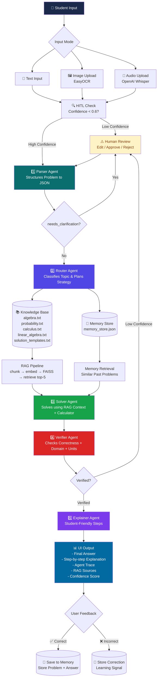

```mermaid
flowchart TD
    A[👤 Student Input] --> B{Input Mode}

    B --> C[📝 Text Input]
    B --> D[🖼️ Image Upload\nEasyOCR]
    B --> E[🎤 Audio Upload\nOpenAI Whisper]

    C --> F[🔍 HITL Check\nConfidence < 0.6?]
    D --> F
    E --> F

    F -->|Low Confidence| G[⚠️ Human Review\nEdit / Approve / Reject]
    F -->|High Confidence| H

    G --> H[1️⃣ Parser Agent\nStructures Problem to JSON]

    H --> I{needs_clarification?}
    I -->|Yes| G
    I -->|No| J[2️⃣ Router Agent\nClassifies Topic & Plans Strategy]

    J --> K[(📚 Knowledge Base\nalgebra.txt\nprobability.txt\ncalculus.txt\nlinear_algebra.txt\nsolution_templates.txt)]
    J --> L[(🧠 Memory Store\nmemory_store.json)]

    K --> M[RAG Pipeline\nchunk → embed → FAISS → retrieve top-5]
    L --> N[Memory Retrieval\nSimilar Past Problems]

    M --> O[3️⃣ Solver Agent\nSolves using RAG Context + Calculator]
    N --> O

    O --> P[4️⃣ Verifier Agent\nChecks Correctness + Domain + Units]

    P --> Q{Verified?}
    Q -->|Low Confidence| G
    Q -->|Verified| R[5️⃣ Explainer Agent\nStudent-Friendly Steps]

    R --> S[📊 UI Output\n- Final Answer\n- Step-by-step Explanation\n- Agent Trace\n- RAG Sources\n- Confidence Score]

    S --> T{User Feedback}
    T -->|✅ Correct| U[(💾 Save to Memory\nStore Problem + Answer)]
    T -->|❌ Incorrect| V[(💾 Store Correction\nLearning Signal)]

    style A fill:#1B2A4A,color:#fff
    style G fill:#fef3c7,color:#92400e
    style H fill:#0B6E6E,color:#fff
    style J fill:#4F46E5,color:#fff
    style O fill:#16a34a,color:#fff
    style P fill:#dc2626,color:#fff
    style R fill:#7c3aed,color:#fff
    style S fill:#0369a1,color:#fff
```
